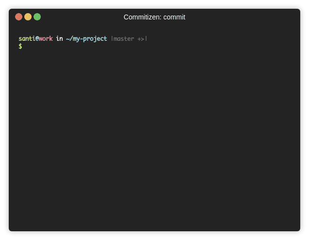
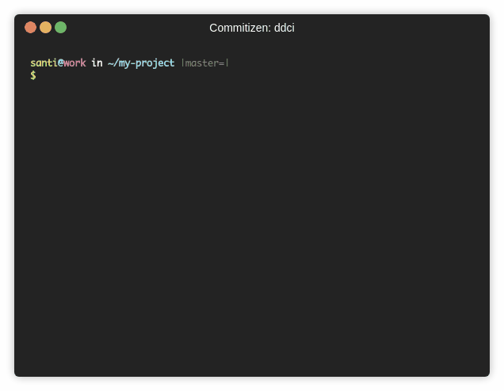

# KPN'S COMMITIZEN

[](https://pypi.org/project/cz-kpn/)
[](https://pypi.org/project/cz-kpn/)




## About

Plugin for [python's commitizen](https://commitizen-tools.github.io/commitizen/),
which uses KPN commit rules to bump versions, update files and generate changelogs.

## KPN Rules summary

### Schema

```bash
<PREFIX> <SUBJECT> (#<ISSUE_ID>)

<LONG_DESCRIPTION>
```

| Prefix  | SemVer relation | Description                                                        |
| ------- | --------------- | ------------------------------------------------------------------ |
| `FIX`   | `PATCH`         | Backwards compatible change that fixes something                   |
| `OPT`   | `PATCH`         | Other changes like refactors, docs, which are backwards compatible |
| `NEW`   | `MINOR`         | New functionality                                                  |
| `BREAK` | `MAJOR`         | Breaking changes                                                   |

### Example

```
NEW: Add login screen (#MY-123)
```

[MORE INFO](./src/cz_kpn/cz_kpn_info.txt)

## Installation

Install globally in your system

```bash
python -m pip install --user cz-kpn
```

Or add `cz-kpn` to your project:

```sh
poetry add cz-kpn --group dev
```

## Quickstart

### Initialize cz-kpn in your project

Answer the questions appearing in:

```sh
cz init
```

### Bumping and changelog

Just run:

```sh
cz bump
```

### Commiting

```sh
cz commit
```

or the shortcut

```sh
cz c
```

### With docker

```sh
cmd="cz -n cz_kpn commit"
docker run --rm -it -v $(pwd):/app kpnnl/cz-kpn:4.0.3 $cmd
```

## Features

### Client tool to assist in the creation of a commit

]

note: gif is outdated

This command is useful for newcomers, or when you don't remember the meaning
of each change type.
It will display a prompt which will guide the user in the commit creation.

```bash
cz commit
```

```bash
git cz commit
```

### Automatic version bump

Automatic version bump with changelog generation.

```bash
cz bump --changelog
```

Note: The `--changelog` flag is not required if `update_changelog_on_bump = true`



### Automatic changelog generation

If you don't want to generate a tag and bump the version, run:

```bash
cz changelog
```

This will create a changelog with unreleased commits, alternatively, you can run

```bash
cz changelog --incremental
```

to add only the missing changes.
This is useful if you have manually modified your changelog.

### Validate commit message

This command will tell you if there are any valid or invalid commit messages in
the given range.

You can also add it to `.pre-commit` hooks or manually as a git hook.

More info in [commitizen website](https://commitizen-tools.github.io/commitizen/check/).

```bash
cz check --rev-range ugnu348hg84hg84g..j8fj84g84h84hg83h2392
```

### Adding commit link to the changelog

Add to the configuration the `commit_url` parameter, using `$COMMIT_REV` as
variable, you can take a look at this project's [.cz.toml](.cz.toml) as an example

```toml
[tool.commitizen]
...
commit_url = "https://YOUR_DOMAIN/projects/YOUR_GROUP/repos/YOUR_PROJECT/commits/$COMMIT_REV"
```

## Configuration

The recommendation is to run `cz init` which will help you create the
right configuration and file.

You can also add manually to your `pyproject.toml` or create a `.cz.toml` file with:

```toml
[tool.commitizen]
name = "cz_kpn"
version = "<YOUR_CURRENT_VERSION>"
version_files = [
  "src/__version__.py"
]
```

## Help

```bash
cz --help
```

Contents:

```bash
$ cz --help
Commitizen is a cli tool to generate conventional commits.
For more information about the topic go to https://conventionalcommits.org/

options:
  -h, --help            show this help message and exit
  --debug               use debug mode
  -n NAME, --name NAME  use the given commitizen (default: cz_conventional_commits)
  -nr NO_RAISE, --no-raise NO_RAISE
                        comma separated error codes that won't rise error, e.g: cz -nr 1,2,3 bump. See codes at
                        https://commitizen-tools.github.io/commitizen/exit_codes/

commands:
  {init,commit,c,ls,example,info,schema,bump,changelog,ch,check,version}
    init                init commitizen configuration
    commit (c)          create new commit
    ls                  show available commitizens
    example             show commit example
    info                show information about the cz
    schema              show commit schema
    bump                bump semantic version based on the git log
    changelog (ch)      generate changelog (note that it will overwrite existing file)
    check               validates that a commit message matches the commitizen schema
    version             get the version of the installed commitizen or the current project (default: installed commitizen)
```

## Testing

For details about supported Python versions and local testing instructions, see [PYTHON_TESTING.md](./PYTHON_TESTING.md).

## Contributing

Read [Contributing guide](./CONTRIBUTING.md)

## Using in a github action

```yaml
name: Bump version and generate changelog

on:
  push:
    branches:
      - main

jobs:
  bump-version:
    if: ${{ !startsWith(github.event.head_commit.message, 'BUMP:') }}
    runs-on: ubuntu-latest
    name: "Bump version and create changelog with commitizen"
    steps:
      - name: Check out
        uses: actions/checkout@v5
        with:
          fetch-depth: 0
          token: ${{ secrets.PERSONAL_ACCESS_TOKEN }}
      - name: Create bump and changelog
        uses: commitizen-tools/commitizen-action@master
        id: cz
        with:
          github_token: ${{ secrets.PERSONAL_ACCESS_TOKEN }}
          changelog_increment_filename: body.md
          extra_requirements: "cz-kpn"
      - name: Release
        uses: softprops/action-gh-release@v1
        with:
          body_path: "body.md"
          tag_name: ${{ steps.cz.outputs.version }}  # Or use env.REVISION
        env:
          GITHUB_TOKEN: ${{ secrets.GITHUB_TOKEN }}
```

The `secrets.PERSONAL_ACCESS_TOKEN` is required in order to trigger other actions observing the tag creation.
An alternative is to use `workflow_call` to trigger the workflow from the current workflow.

Read more in [commitizen docs](https://commitizen-tools.github.io/commitizen/tutorials/github_actions/)
